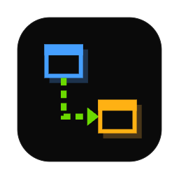

# yart

Yet another review tool.

**Designed to be controlled by AI.** yart shows how data flows through a codebase as
animated sequence diagrams, with documents and code reviews that point straight into
them. You don't draw anything yourself: an AI agent reads your code and delivers the
flows, and yart checks that every file and line they point at exists before drawing
them.

## Two ways to use it

- **Connect the AI on your machine.** yart runs Claude Code or Codex in the background
  and you ask your questions in the app's Agent panel, or click a node in a flow.
- **Use an external AI through MCP and skills.** Any agent that speaks MCP can connect
  to the server yart starts and deliver flows, documents and reviews there. A skill
  teaches the agent when and how to use yart.

```bash
claude mcp add --transport http yart http://127.0.0.1:7390/mcp
```

The first launch opens a guide for both paths and can install the skill for you.

## Repository

- [`yart-app/`](yart-app/) – the desktop app (Electron, React, TypeScript)
- A website for sharing diagrams is planned.

## Getting started

```bash
cd yart-app
npm install
npm run dev
```

`yart-app/demo/todo-app` is a small app to try it on: React frontend, Express backend,
Postgres and Redis, with built-in analyses and a demo review.

## License

[MIT](LICENSE)
